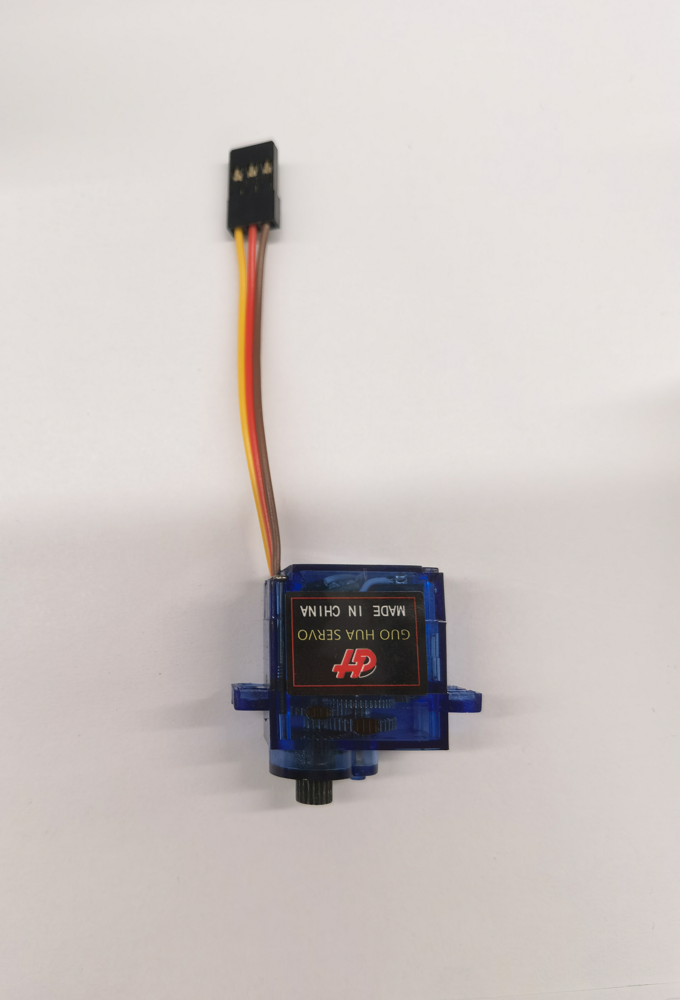

# WatcheRobot Hardware 0.2.0

[English](./README.md) | 简体中文

WatcheRobot 的头部模组并不是从零重新设计的，而是基于 Seeed Studio 开源的 **OSHW SenseCAP Watcher** 硬件项目继续开发而来。这个仓库中的硬件部分主要补充了桌面机器人底座、电路板、结构模型、舵机机构和充电板相关内容。

上游开源项目：

- [Seeed-Studio/OSHW-SenseCAP-Watcher](https://github.com/Seeed-Studio/OSHW-SenseCAP-Watcher)

在上游设计基础上，我们增加了：

- 机器人底座 PCB
- 磁吸 Pin Type-C 充电板
- 整机结构模型
- 舵机驱动运动机构

## 目录总览

当前 `Hardware/` 目录按用途划分如下：

```text
Hardware/
|-- pcb/
|   |-- adapter-board/
|   `-- magnetic-pin-typec-charging-board/
|-- models/
|   `-- step/
|-- assets/
|   |-- servo.jpg
|   `-- watcher-exploded-view-animation-v1.avi
|-- LICENSE
|-- README.md
`-- README.zh-CN.md
```

## PCB 文件

### `pcb/adapter-board/`

转接板 PCB 资料。

包含内容：

- `altium-export-2026-03-31/`：Altium 导出的源设计文件
- `bill-of-materials.xlsx`：物料清单
- `gerber-2026-03-31.zip`：打板用 Gerber 包
- `pcb.webp`：PCB 预览图
- `schematic.png`：原理图预览图

### `pcb/magnetic-pin-typec-charging-board/`

磁吸 Pin Type-C 充电板资料。

包含内容：

- `altium-export-2026-03-31/`：Altium 导出的源设计文件
- `bill-of-materials.xlsx`：物料清单
- `gerber-2026-03-31.zip`：打板用 Gerber 包
- `pcb.webp`：PCB 预览图
- `schematic.webp`：原理图预览图

## 模型

### `models/step/`

这里保存当前整机结构模型。

当前模型：

- [`watcherRobot.step`](./models/step/watcherRobot.step)

## 舵机

WatcheRobot 使用 **2 个 MG90 舵机** 作为机器人双轴运动机构。

舵机参考图：



## 爆炸图

`assets/` 目录中保存用于文档说明和展示的资源文件。

当前爆炸视图资源：

- [`watcher-exploded-view-animation-v1.avi`](./assets/watcher-exploded-view-animation-v1.avi)

说明：

- 该动画用于展示机器人结构拆分和装配关系。
- 由于 `avi` 文件通常不能直接在 GitHub README 中内嵌播放，因此这里以链接形式提供，适合下载后本地查看。

## 使用说明

- `pcb/` 用于保存可修改、可生产的电路设计资料
- `models/` 用于保存结构件和装配模型
- `assets/` 用于保存 README 图片、预览图和爆炸视图等展示资源
- 机器人头部原始硬件设计请参考上游 `OSHW-SenseCAP-Watcher`

## 参考资料

- [OSHW SenseCAP Watcher](https://github.com/Seeed-Studio/OSHW-SenseCAP-Watcher)
- [SenseCAP Watcher 硬件概述](https://wiki.seeedstudio.com/cn/watcher_hardware_overview)
