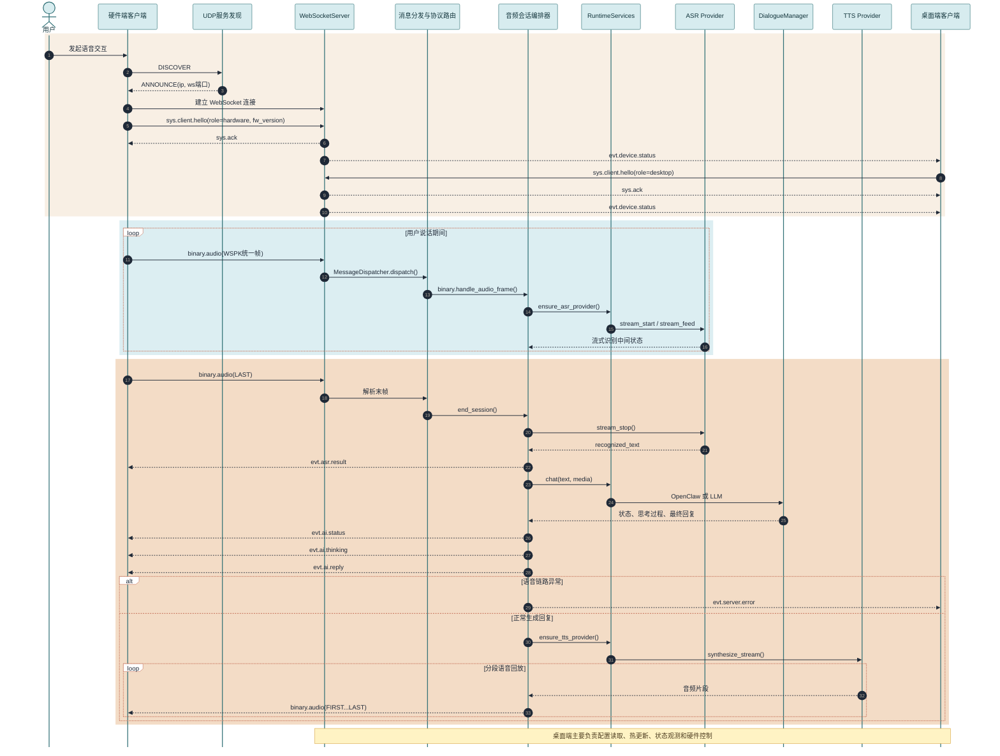
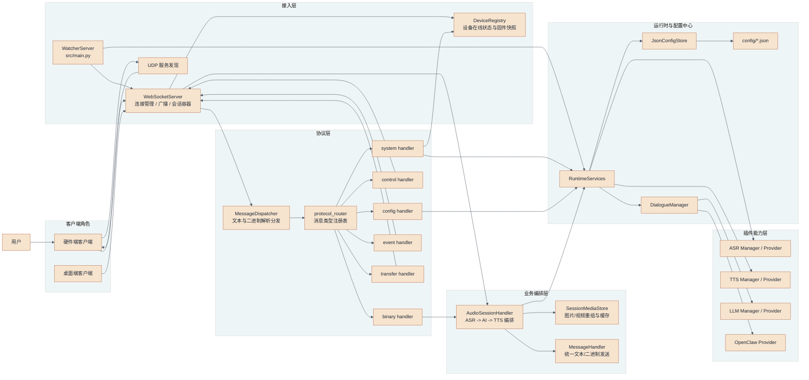
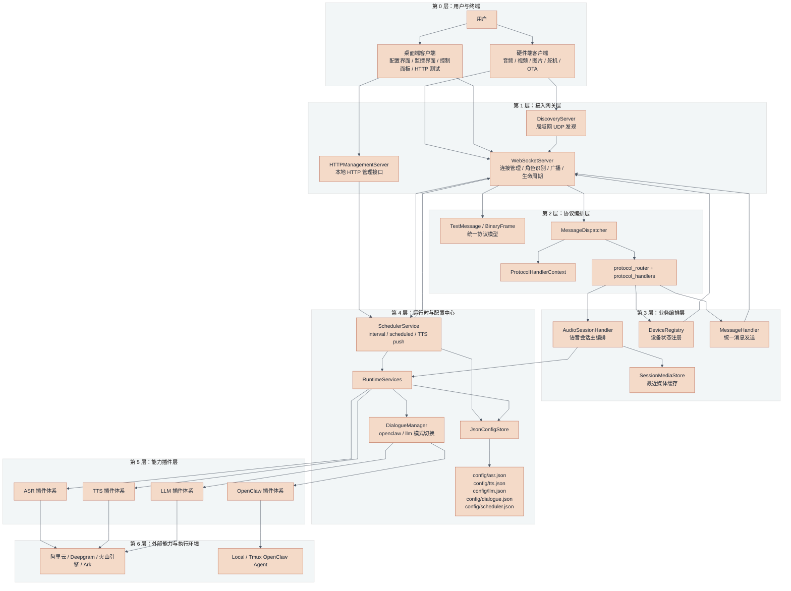
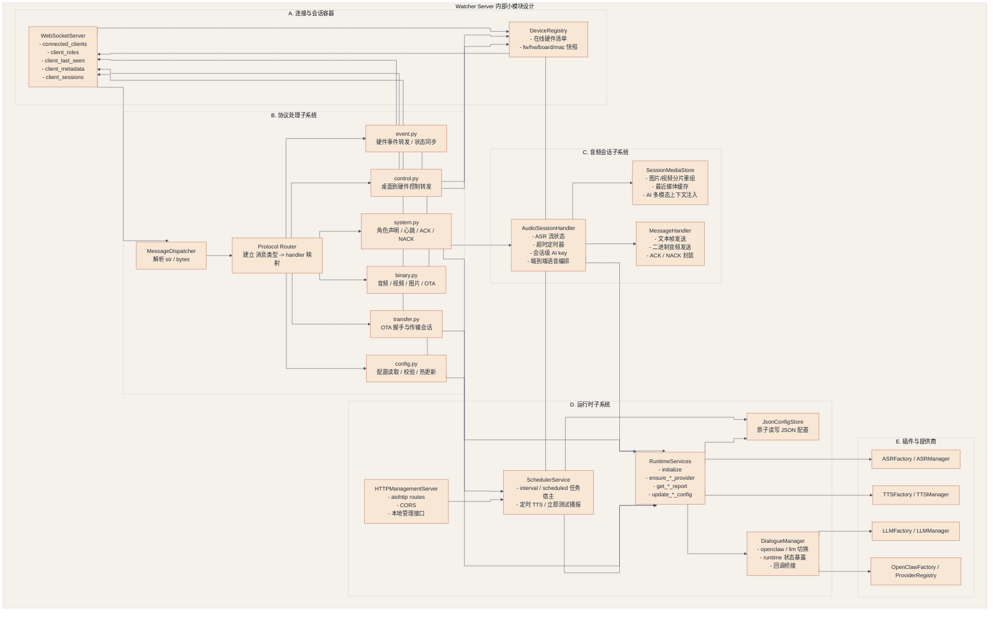

# Watcher Server 系统设计图谱（中文）

本文档基于以下文档与源码整理：

- `docs/device_communication_protocol.md`
- `docs/AI_CONTEXT.md`
- `docs/ESP32_SERVICE_DISCOVERY.md`
- `src/core/websocket_server.py`
- `src/core/audio_session_handler.py`
- `src/core/runtime_services.py`
- `src/core/protocol_router.py`
- `src/core/protocol_handlers/*`
- `src/core/session_media.py`
- `src/utils/message_handler.py`

目标：

- 画出系统的用户主时序图
- 画出模块关系图
- 画出整体大架构图
- 画出大架构下的小模块拆解图
- 画出数据流设计图

## 1. 用户主时序图

这个时序图覆盖了“设备发现 -> 建连 -> 用户说话 -> ASR -> AI -> TTS -> 回放”的主链路，并补上了桌面端的状态观察路径。

## 2. 模块之间的关系

这个图强调的是“谁依赖谁、谁调谁、谁负责转发”。

## 3. 整个大架构设计

这个图更接近“总览图”，按层把系统拆成用户终端、接入网关、协议编排、业务编排、运行时中心和插件能力。

## 4. 大架构下每个小模块的设计

这个图把服务端内部拆得更细，适合拿来讲代码结构和职责边界。

### 小模块职责摘要

- `WebSocketServer`：负责连接生命周期、连接角色、会话对象、广播能力和发现服务挂载。
- `HTTPManagementServer`：负责本地 HTTP 管理接口、CORS 兼容，以及为桌面端测试页提供定时 TTS 管理入口。
- `MessageDispatcher + protocol_router`：负责把文本帧/二进制帧分发到正确 handler，不直接承载业务逻辑。
- `protocol_handlers/*`：负责协议准入、角色校验、本地处理、跨角色转发和拒绝策略。
- `AudioSessionHandler`：负责语音主链路编排，串起 `ASR -> AI -> TTS`，并在异常时把 `evt.server.error` 广播给桌面端。
- `SessionMediaStore`：负责缓存最近图片/视频，为 OpenClaw 多模态问答提供上下文。
- `SchedulerService`：负责托管间隔任务和定时任务，并复用统一的 TTS 下发链路给 scheduler 与 HTTP 立即测试接口。
- `RuntimeServices`：负责配置中心、运行时热更新、Provider 初始化和对话模式切换。
- `Factory / Manager / Provider`：负责插件化扩展，不同 ASR/TTS/LLM/OpenClaw 实现都通过统一入口接入。

## 5. 数据流设计

这个图重点强调系统里真正存在的 4 类主数据流：语音主链路、配置链路、状态/控制链路、媒体上下文链路。

```mermaid
%%{init: {
  "theme": "base",
  "themeVariables": {
    "background": "#fffaf4",
    "primaryColor": "#f5e0cf",
    "primaryTextColor": "#1f2937",
    "primaryBorderColor": "#bd6e55",
    "secondaryColor": "#dbedf0",
    "tertiaryColor": "#f7f3ed",
    "lineColor": "#4b5563",
    "fontFamily": "PingFang SC, Hiragino Sans GB, Microsoft YaHei, sans-serif"
  },
  "flowchart": {
    "curve": "basis",
    "htmlLabels": true
  }
}}%%
flowchart TB
    subgraph FLOW_A["数据流 A：语音主链路"]
        A1["硬件端 binary.audio"] --> A2["binary handler"]
        A2 --> A3["AudioSessionHandler.feed_audio / end_session"]
        A3 --> A4["ASR.stream_feed / stream_stop"]
        A4 --> A5["evt.asr.result"]
        A5 --> A6["RuntimeServices.chat"]
        A6 --> A7["DialogueManager / OpenClaw / LLM"]
        A7 --> A8["evt.ai.status / evt.ai.thinking / evt.ai.reply"]
        A8 --> A9["TTS.synthesize_stream"]
        A9 --> A10["下行 binary.audio"]
    end

    subgraph FLOW_B["数据流 B：配置中心链路"]
        B1["桌面端 cfg.*.get / cfg.*.update"] --> B2["config handler"]
        B2 --> B3["RuntimeServices"]
        B3 --> B4["JsonConfigStore"]
        B4 --> B5["config/*.json"]
        B3 --> B6["ASR / TTS / LLM / Dialogue 热切换"]
        B6 --> B7["cfg.*.report 广播到桌面端"]
    end

    subgraph FLOW_C["数据流 C：状态与控制链路"]
        C1["桌面端 ctrl.servo.angle"] --> C2["control handler"]
        C2 --> C3["广播到硬件端"]
        C4["硬件端 evt.* / xfer.ota.handshake"] --> C5["event / transfer handler"]
        C5 --> C6["广播到桌面端"]
        C7["硬件端 evt.device.firmware"] --> C8["DeviceRegistry 更新"]
        C8 --> C9["evt.device.status 广播"]
    end

    subgraph FLOW_D["数据流 D：媒体上下文链路"]
        D1["硬件端 binary.video / binary.image"] --> D2["binary handler"]
        D2 --> D3["SessionMediaStore 重组与缓存"]
        D3 --> D4["AudioSessionHandler 调用 RuntimeServices.chat(media=...)"]
        D4 --> D5["OpenClaw Provider 多模态输入"]
    end

    subgraph FLOW_E["数据流 E：本地 HTTP 管理链路"]
        E1["desktop test_client.html"] --> E2["HTTPManagementServer"]
        E2 --> E3["SchedulerService"]
        E3 --> E4["config/scheduler.json"]
        E3 --> E5["TTS.synthesize_stream"]
        E5 --> E6["下行 binary.audio -> hardware"]
    end
```

## 6. 设计结论

### 6.1 这个系统本质上是什么

`watcher-server` 本质上不是单纯的 WebSocket 透传服务，而是一个：

- 统一协议网关
- 双客户端角色编排中心
- 语音会话主流程编排器
- 配置中心与运行时热更新中心
- 可插件化扩展的 AI 能力接入层

### 6.2 当前最核心的 5 条主线

1. `hardware` 与 `desktop` 通过 `sys.client.hello` 进入双角色模型。
2. 所有文本与二进制数据都先进入统一协议层，再路由到 handler。
3. 语音主链路由 `AudioSessionHandler` 串起 `ASR -> AI -> TTS`。
4. 配置更新由 `RuntimeServices` 负责落盘、校验、热切换和广播。
5. 图片/视频不是独立业务闭环，而是会作为最近媒体上下文注入 AI 会话。
6. 定时 TTS 管理同时支持 WebSocket 配置链路和本地 HTTP 管理链路，但两者最终都汇总到 `SchedulerService`。

### 6.3 当前明确已接通与未完成的边界

- 已接通：`sys.client.hello`、配置读写、舵机控制转发、设备状态同步、音频会话主链路、视频/图片转发、媒体上下文注入。
- 已注册但未完成：`sys.session.resume`、`ctrl.camera.*`、完整 OTA 传输闭环。
- 明确拒绝客户端伪造：`evt.asr.result`、`evt.ai.*`、`evt.server.error`、上行 `binary.ota`。
